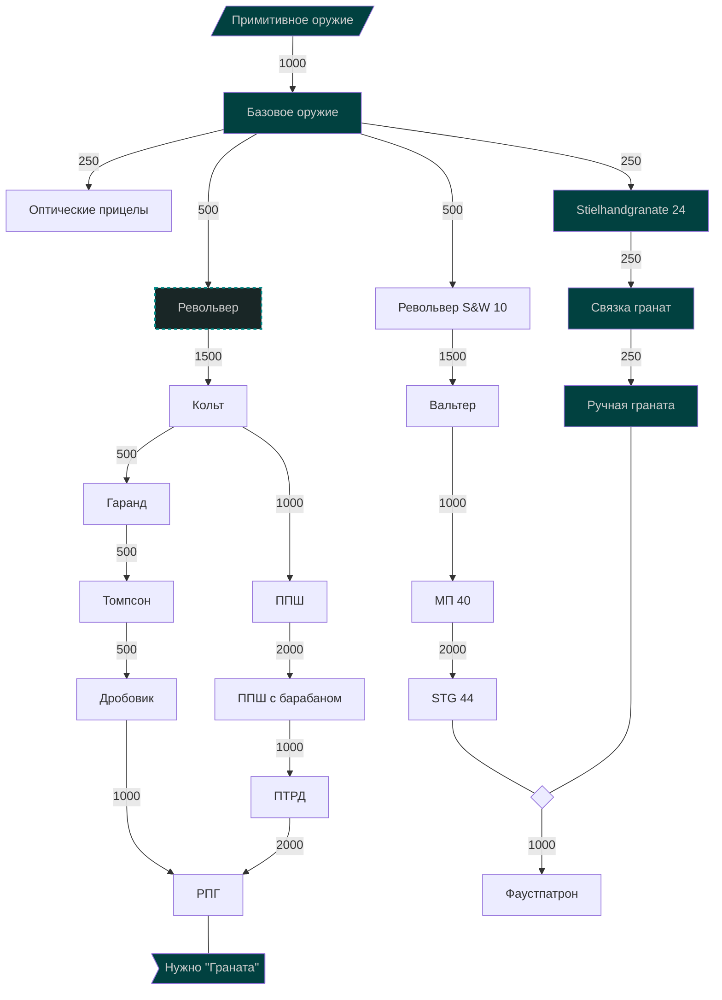
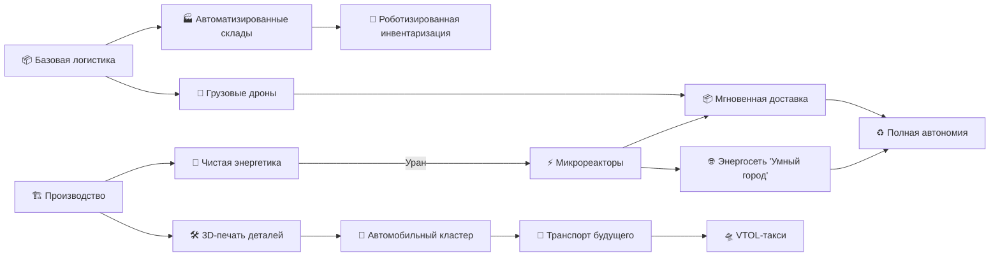
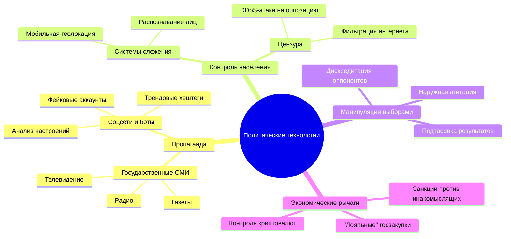

## Предисловие
Это всё просто наброски идей, всё что в голову пришло. Большая часть из этого, вероятно, не войдёт в финальный концепт по тем, или иным причинам. Порядок пунктов не соответствует планируемому (по большей части). Файл изначально создавался (да и сейчас им является) набором пунктов, которые я либо хочу поднять в финальном документе (проблемы и аналитика, к примеру), либо просто продумать и поразвивать дальше (механики и т.д).

## Я это читаю
Если вы это читаете - значит я попросил вас оценить мои идеи. Хейтить не надо, я прошу только написать конструктивную критику тех, или иных моментов. Моя задача - посодействовать в развитии проекта до стабильных 80-100 активных членов сообщества. Проще говоря, - в развитии проекта.

#### Вместе с этим файлом ещё должен идти документ правил сервера и первичный админ-устав.

- Цель документа ✅
- Целевая аудитория ✅ 
- Проблемы прошлого хоума и как их будет решать новый хоум ✅
	- Скучно
	- Работка (строй завод, потом ещё один)
	- Очень мало рп
	- Мало новых игроков, в стране зачастую один
	- Пара-тройка стран гигантов, которые уже всё построили и которым нехуй делать
	- Токсичное комьюнити
	- Абуз правил, в том числе, со стороны администрации 💀💀💀 (фарминг территорий со стороны Космополита, Нариона (Норан все помним?), ещё Северная и Южная Дистории)
- Лор✅
- Внутриигровые события (простые и +- частые, по типу погоды, магнитных бурь и других, не влияющих сильно на игру, но создающие некоторую атмосферу и дающие написать пару-тройку новостей игрокам, возможно кого-то сподвигнет построить что-то (например, метеостанцию))✅
- Мир✅
	- Бункеры
	- Руины(?)
	- Реки
	- Биомы✅
		- Антарктика / Тундра
		- Тайга
		- Умеренный
		- Тёплый/Жаркий
		- Пустыня (?)
- Политика
	- Страны, штаты, группировки, альянсы
	- Восстания/революции
-  Войны
	- Проведение битв
	- Правила техники
	- Дивизии
	- Ядерное оружие
	- Химическое оружие
- Экономика
	- Ресурсы: не должно быть такого, что какой-то ресурс применяется почти везде, что у кого-то есть все ресурсы. Игроки должны торговать✅
		- Необработанные✅
			- Камень
			- Дерево
			- Металл
			- Нефть
			- Цвет. металл
			- Уран
			- Уголь
		- Обработанные/не требующие обработки✅
			- Стройматериалы
			- Сталь
			- Микросхемы
			- Топливо
			- Химикалии
			- Ядерное топливо
			- Обогащённый уран
			- Кокс (для стали)
	- Еда⛔
		- Овощи
		- Фрукты
		- Животноводство (?)
		- Фермы (ещё в зависимости от биома, можно будет выращивать разные продукты)
		- Потребность в еде
	- Колонизация✅
	- Товары✅
	- Валюты (помню, играл в Zombix Online, там валюты как таковой не было, все торговали золотом, так как это был очень ценный ресурс и это было очень интересно! менять ржаву, металл, гвозди, шестерёнки, лампочки и прочий хлам на золото, а золото уже менять на мотоциклы (у других игроков), или делать из золота топ тир сумки, бронники, оружие, генераторы мотоциклов (там была интересная система с ними, конечно))✅
	- Обеспечение спроса✅
	- Дефицит ресурсов✅
	- Производство✅
		- Добывающие предприятия (шахты, каменоломни, скважины)
		- Обрабатывающие предприятия (металлургии, нефтепереработки, цементные заводы)
		- Производящие предприятия (товары, техника)
	- Логистика✅
		- Поезда
		- Дороги
		- Мосты
		- Порты
		- Судоходство
	- Энергетика✅
		- Электростанции (ТЭС, ГЭС, ПЭС, ГеотЭС, АЭС)
- Наука✅
	- Гражданские технологии
	- Военные технологии
	- Космические технологии
	- Древо технологий (можно даже интерактивные графы делать через бота, с помощью языка разметки mermaid, правда открывать нужно будет через браузер т.к в дискорд поддержки нет и вряд ли будет; можно генерировать html странички с нужным контентом, которые можно будет открывать по ссылке (базовая страница с текстом-наполнением mermaid, который обработает вложенный (в сам html в блок script) js код из библиотеки mermaid (как с markdown короче)), это не так сложно, хотя на это может уйти пара дней (настройку и отладку), а ещё можно генерировать изображения и отправлять их в discord (всё просто, всё уже придумали и разработали, нужно только подключить нужные библиотеки))
- Космос✅
	- Планеты и их освоение✅
		- Холодная планета с жизнью в виде колоний бактерий (крупных колоний, например, похожих на волосатые пузыри)
	- Доп. ресурсы✅
		- Тетраниум
		- Турбиний
		- Чёт ещё было
	- Космические сооружения✅
		- Космические станции
- Решение конфликтов✅
- Поощрение примерного поведения✅
- Предотвращение рецидива✅
- Наказания✅
- Должности и обязанности (один человек может занимать сразу несколько)✅
	- Глава проекта - руководит проектом, распределяет задачи, отвечает за курс развития проекта. Самый главный.✅
	- Режиссёр - ведёт линию сюжета, делает всё возможное, чтобы получалось много интересного РП. Считай бог и кукловод, очень ответственная должность.✅
	- Гейм-мастер - сначала был режиссёром, но я думаю можно записать в помощники последнего✅
	- Модератор - отвечает за уютную атмосферу на проекте✅
	- Заведующий правил - пишет правила✅
	- Тех-админ - занимается ботами, спец. модами, дискорд-каналами и т.д.✅
	- Ассет-мейкер - создаёт тайлы, миры, мб постройки для хоумчан (в первую очередь, тайлы)✅
	- Проверяющий (такой тех админ)✅
	- Картограф✅
- Глава проекта (подробнее)✅
- Смена глав проекта✅
- Рабочие процедуры (конфликт на сервере, ещё хуйня какая, протоколы короче чтоб не думать лишний раз)✅
- Админ-устав (админ - это призвание)✅
- Сборка (моды и т.д)✅
- Бот экономики✅
- Бот модерации✅
	-  Удобный инструмент для модерирования, будет хранить в себе весь архив и т.д.
- Road-map✅
- Обратная связь: методы для получения и обработки✅
- Глобальные ивенты✅
	- Эпидемии
	- Землетрясения
	- Метеор
	- Другие катаклизмы, чья суть подогреть интерес и заставить работать разных игроков сообща
- Ачивки✅
	- Просто чтобы играть было интересно достижения какие-нибудь (желательно связанные с хоумом)

### Идеи:
- Пускай для спорных (не абсурдных! то есть в теории возможных) РП действий, или повторяющихся событий с небольшим шансом успеха (чел хочет сбежать в третий раз) кидается кубик как в днд
- Будем делать ассеты (тайлы, миры) чтобы людям не приходилось играть в ванильных скучных мирах. Люди по типу миксера умеют делать восхитительные тайлы! Это можно использовать для привлечения интереса
- Будем делать бесплатные постройки (в рамках разумного), чтобы не нужно было каждому Васе Пупкину строить всё на свете чтобы порпшить. В первую очередь, для облегчения рп. Чтобы вам не нужно было 2 недели строить зал совета, чтобы пару раз там с кем-то побеседовать по рп. Не будут засчитываться (кроме жилых зданий, так как туалет может построить каждый, но лучше у человека будет красивый город, чем куча мусорных контейнеров сложенных штабелями, как в первом ИИШ третьего сезона) в плане механик. 
- Упор на ролеплей
- Гейм-мастер / Режиссёр, которые будут отвечать за интересный рп между игроками (будут их к этому толкать)
- Правила нужны для поднятия интереса к игре, а не для глупых ограничений. Если правила не позволяют отыгрывать пиратов, живущих на плавучем городе в море и занимающихся рейдерством торговых судов - правила подлежат пересмотру, а не наоборот. Если правила сдерживают адекватный (хороший, интересный, неплохой) ролеплей игроков, или обще говоря, делают ролевой / игровой опыт хуже - то это однозначно плохие правила.
- Ресурсов и промышленных предприятий много для того, чтобы у одной страны не было всего на свете. Игроки должны кооперироваться и торговать. Например, один человек нашёл железо, другой угль, оба они продают их металлургии и покупают обратно сталь. Это также означает, что не должно быть универсальных или совершенно бесполезных ресурсов.
- К нам зашёл игрок, который просто хочет строить домики, но у него в стране нет ресурсов, что делать? Пускай купит! А мы должны сделать так, чтобы ему: А: Было на что купить; Б: Кто-то мог продать. А зарабатывает себе на стройматериалы он пусть каким-нибудь заводиком, который из железа будет делать пивные кружки или я хуй знает. Главное ещё в правилах прописать, что даже без стройматериалов он может строить то, что захочет, просто это нельзя будет зарегистрировать. На самом деле, я бы ещё подумал над этим вопросом. Хотя отсутствие ресурсов он может даже использовать для вдохновения - пускай строит из мусора! Будет TrashTown.
- Вот эти моды в сборку https://github.com/QuestionableM (войс + звуки)
- Прогресс технологий - это восстановление архивных данных!
- Игроки иногда хотят пострелять, нужно удовлетворить это желание в рамках РП, иначе будут войны ради войн и никакого рп (да и смысл тогда в правилах военки)
- Пехотное оружие будет производится партиями. 1 партия на 1го реального игрока. Может ещё только на одну битву?

### Технологии вооружения
Цвет для завершённого - `#014140`
- Поинты на вскидку

**Примитивное оружие**
- Пехотный нож
- Еока

**Базовое оружие**
- Двустволка
- Винтовка Мосина
  
**Оптические прицелы**
- Снайперская винтовка Мосина
# Mermaid
---
- [Live editor](https://mermaid.live/edit#pako:eNpVjbFugzAQhl_FuqmVIAKcuMFDpYa0WSK1Q6ZCBitcMEqwkTFKU-Dda4iitjfd6fv-_zo46ByBw_GsLwcpjCW7daaIm5c0kaZsbCWaPfH9536DllRa4bUnq4eNJo3UdV2q4vHmr0aJJN121JBYWarTcEPJlH9X2JN1uhW11fX-L9lddE9e0_JDuvr_RBp0qbf0KPhR-AdhSCLMpIAHhSlz4Na06EGFphLjCd1IM7ASK8yAuzUX5pRBpgaXqYX61Lq6x4xuCwmu-9y4q61zYXFdisKIXwVVjibRrbLAYzZVAO_gCzilwSyklLI5ZXHMgtCDK3A_pLNoEQQRi8NozpbLiA0efE9fg9nyaTH8ACQQcyM)
- [Habr guide](https://habr.com/ru/articles/652867/)

